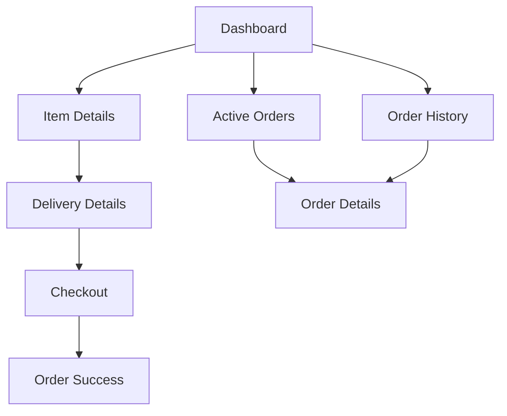

# Customer Module Documentation

## Overview
The customer module manages the order creation and tracking flow in Alphalogistics. 

## Screens Flow


## Key Components

### 1. Item Details Screen
**Purpose**: Item management for orders

**Key Features**:
- Category and subcategory selection with validation
- Detailed item information input
- Image upload with size/type validation
- Special handling options
- Item list management with totals

**Core Functions**:
```typescript
validateForm(): string[] // Weight range and required field validation
handleAddItem(): Promise<void> // Add item with proper number handling
calculateDeliveryFee(weight: number): number // Progressive fee calculation
```

### 2. Delivery Details Screen 
**Purpose**: Sender/receiver information and delivery preferences

**Key Features**:
- Collapsible sections for better UX
- Dynamic delivery method handling
- Real-time delivery fee calculation
- Vehicle type selection with weight limits

**Core Functions**:
```typescript
validateForm(): string[] // Context-aware validation
calculateDeliveryFee(weight: number): number
handleSubmit(): Promise<void>
```

### 3. Storage Service
**Purpose**: Order draft management

**Key Methods**:
```typescript
validateOrderStorage(data: any): boolean // Type-safe validation
saveOrderDraft(data: Partial<OrderDraft>): Promise<void>
initializeOrderDraft(): Promise<void>
```

## Data Models

### SenderDetails
```typescript
export interface SenderDetails {
  name: string;
  phone: string;
  address: string;
  state: string;
}
```

### ItemDetails
```typescript
export interface ItemDetails {
  category: string;
  subcategory: string;
  name: string;
  weight: number;
  quantity: number;
  value: number;
  imageUri?: string;
  images?: string[];
  isFragile?: boolean;
  requiresSpecialHandling?: boolean;
  specialInstructions?: string;
  dimensions?: {
    length: number;
    width: number;
    height: number;
  };
}
```

## Business Rules

### Delivery Fee Calculation
```typescript
const calculateDeliveryFee = (weight: number): number => {
  let fee = 1000; // Base fee
  if (weight <= 5) fee += weight * 200;
  else if (weight <= 20) fee += 1000 + (weight - 5) * 150;
  else fee += 3250 + (weight - 20) * 100;
  return Math.round(fee);
};
```

### Vehicle Weight Limits
```typescript
const VEHICLES = {
  bike: { maxWeight: 100 },
  car: { maxWeight: 500 },
  truck: { maxWeight: 1000 }
};
```

## Integration Points
1. Firebase Auth for user management
2. Firestore for order storage
3. React Native Image Picker
4. AsyncStorage for draft persistence

## Error Handling
1. Form validation with specific messages
2. Type-safe storage validation
3. Image upload constraints
4. Network error recovery

## Testing Guidelines
1. Form validation scenarios
2. Fee calculation accuracy
3. Data persistence verification
4. Image upload handling
5. Navigation state preservation