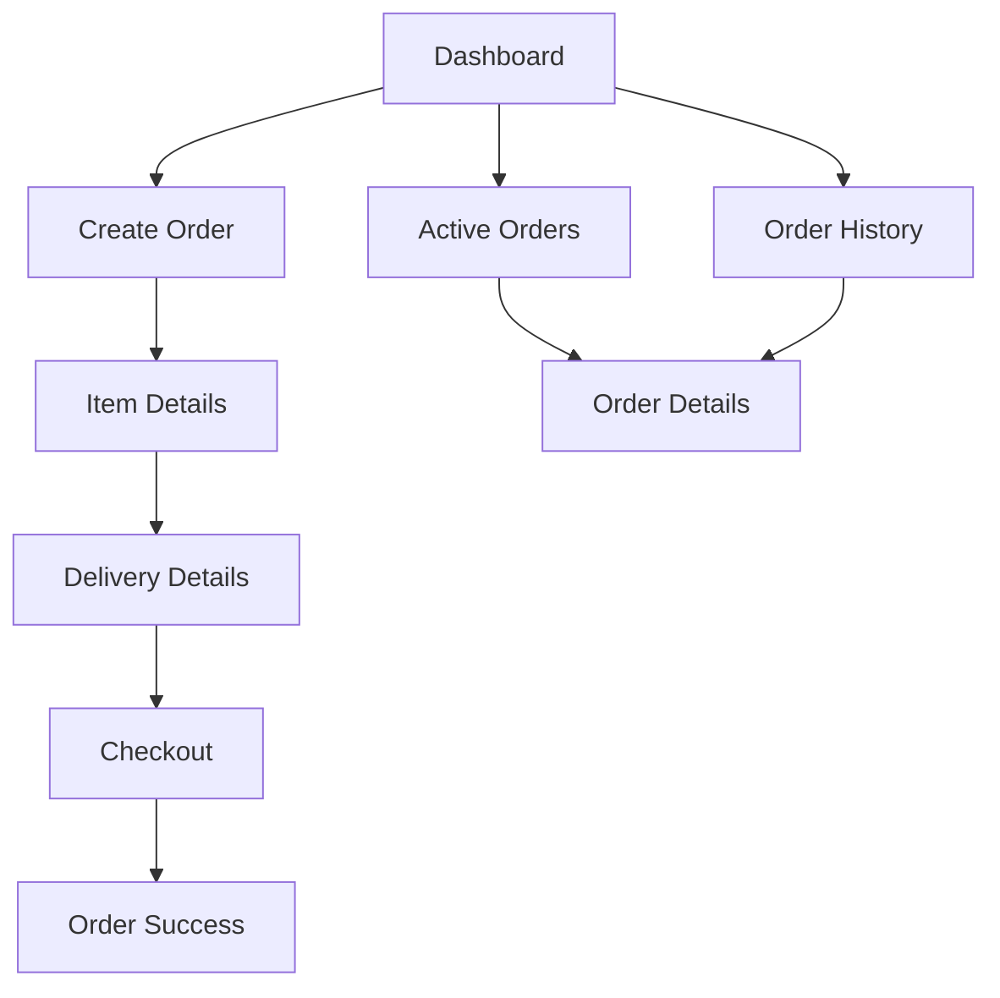

# Customer Module Documentation

## Overview
The customer module handles the entire order creation and management flow for customers in the Alphalogistics application. This document outlines the core functionality, screens, and data flow.

## Screens Flow


## Core Components

### 1. Item Details Screen
**Location**: `/app/(dashboard)/customer/item-details.tsx`

**Purpose**: Allows customers to add items to their order.

**Key Features**:
- Item category and subcategory selection
- Item details input (name, weight, value, quantity)
- Special handling options
- Image upload capability
- Running total calculation

**Important Functions**:
```typescript
validateForm(): string[] // Validates item input
handleAddItem(): Promise<void> // Adds item to order draft
handleUpdateItem(index: number, updates: Partial<ItemDetails>): void // Updates existing item
calculateTotals(items: ItemDetails[]): { totalWeight: number; totalValue: number }
```

### 2. Delivery Details Screen
**Location**: `/app/(dashboard)/customer/delivery-details.tsx`

**Purpose**: Captures sender and receiver information, delivery preferences.

**Key Features**:
- Sender/receiver contact details
- Delivery method selection (pickup/delivery)
- Vehicle type selection
- Delivery scheduling

**Important Functions**:
```typescript
validateForm(): string[] // Validates delivery details
calculateDeliveryFee(weight: number): number // Calculates delivery fee based on weight
handleSubmit(): Promise<void> // Saves delivery details and proceeds to checkout
```

### 3. Storage Service
**Location**: `/services/storage.ts`

**Purpose**: Manages order draft persistence.

**Key Methods**:
```typescript
saveOrderDraft(data: Partial<OrderDraft>): Promise<void>
getOrderDraft(): Promise<OrderDraft | null>
clearOrderData(): Promise<void>
initializeOrderDraft(): Promise<void>
```

## Data Models

### Order Draft
```typescript
interface OrderDraft {
  sender: SenderDetails;
  receiver?: ReceiverDetails;
  delivery: {
    scheduledPickup: string;
    vehicle: string;
    fee: number;
  };
  locations: OrderLocations;
  items: ItemDetails[];
  pricing: {
    itemValue: number;
    deliveryFee: number;
    total: number;
  };
  orderDetails?: {
    status: 'draft';
    createdAt: string;
    updatedAt: string;
  };
}
```

### Item Details
```typescript
interface ItemDetails {
  category: string;
  subcategory: string;
  name: string;
  weight: number;
  quantity: number;
  value: number;
  imageUri?: string;
  images?: string[];
  isFragile?: boolean;
  requiresSpecialHandling?: boolean;
  specialInstructions?: string;
  dimensions?: {
    length: number;
    width: number;
    height: number;
  };
}
```

## Category Configuration
```typescript
const CATEGORIES_WITH_SUBCATEGORIES: Record<CategoryType, Array<{ 
  name: string; 
  weightRange: { 
    min: number; 
    max: number; 
    step: number 
  } 
}>>
```

## Important Constants

### Vehicle Types
```typescript
const VEHICLES: Record<string, { maxWeight: number }> = {
  bike: { maxWeight: 100 },
  car: { maxWeight: 500 },
  truck: { maxWeight: 1000 }
};
```

### Image Constants
```typescript
const MAX_IMAGE_SIZE = 5 * 1024 * 1024; // 5MB
const MAX_IMAGES_PER_ITEM = 3;
const ACCEPTED_IMAGE_TYPES = ['image/jpeg', 'image/png'];
```

## Business Rules

### Delivery Fee Calculation
1. Base fee: 1000
2. Weight-based additional charges:
   - ≤ 5kg: 200/kg
   - 5-20kg: 1000 + 150/kg over 5kg
   - >20kg: 3250 + 100/kg over 20kg

### Validation Rules
1. Item weight must be within category-specific ranges
2. Required fields:
   - Item: name, category, subcategory, quantity, weight, value
   - Sender: name, phone, address, state
   - Receiver: name, phone, state, address (if delivery method is 'delivery')

## State Management
- Uses React's useState for local state
- AsyncStorage for order draft persistence
- Firebase for final order storage

## Error Handling
1. Form validation with specific error messages
2. Storage service error handling
3. Image upload validation and error handling

## Security Considerations
1. User authentication required
2. Data validation before storage
3. Image size and type restrictions
4. Firebase security rules

## Integration Points
1. Firebase Authentication
2. Firebase Firestore
3. Image Picker
4. AsyncStorage
5. Payment Gateway (to be implemented)

## Development Guidelines
1. Use TypeScript for type safety
2. Follow the established component structure
3. Implement proper error handling
4. Add console logging for debugging
5. Validate data at each step
6. Use constants for configuration values

## Testing Considerations
1. Form validation
2. Data persistence
3. Image upload
4. Fee calculations
5. State management
6. Error scenarios